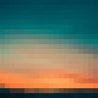
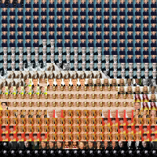
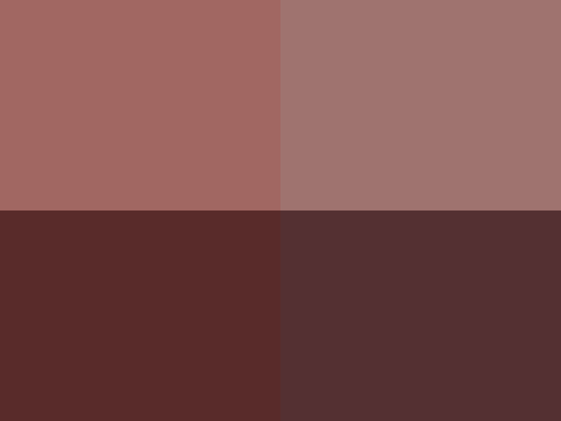
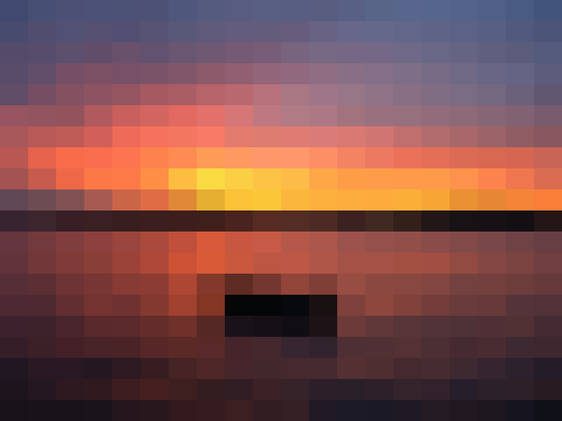
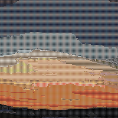
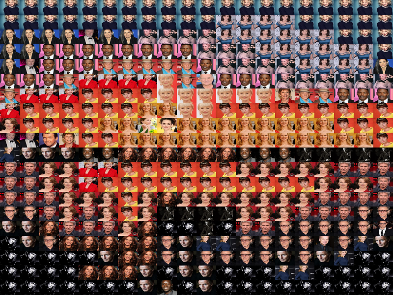
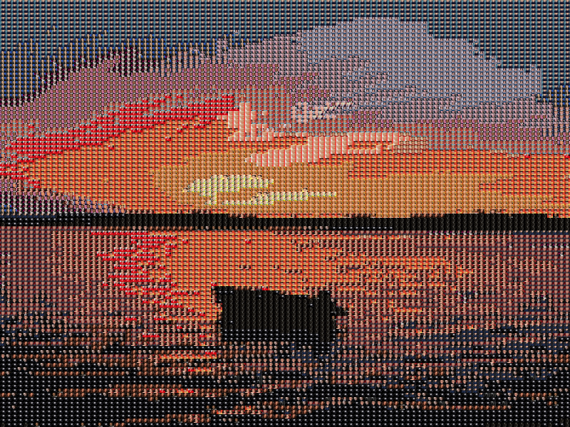

# PHP7 + GD Photomosaic Generator

[](http://www.paypal.me/AlcidesRC)

This package provides a PHP7 class that allows to create an image mosaic or photomosaic: a picture that has been divided into tiled sections, each of them can be filled with plain colors or filled with similar images.

| Image                                           | Mosaic with Plain Colors                                     | Mosaic with Similar Images                                   |
| ----------------------------------------------- | ------------------------------------------------------------ | ------------------------------------------------------------ |
|  |  |  |

## Table of Contents

- [Caveat](#caveat)
- [Features](#features)
- [Usage](#usage)
- [Installation](#installation)
- [API Documentation](#api-documentation)
- [Running Tests](#running-tests)
- [TODO](#todo)
- [Changelog](#changelog)
- [License](#license)

## Caveat

This project has been developed as a *proof of concept* to practice some image processing and color manipulation skills.

## Features

### Generate a mosaic with plain colors per section

This process divides the source image into a matrix with specific number of rows and cols and generating a resultant image with same dimensions and section distributions.

On the resultant image each section is filled with the average color of that section from source image.

### Generate a mosaic with similar images per section

This process divides the source image into a matrix with specific number of rows and cols and generating a resultant image with same dimensions and section distributions.

On the resultant image each section is filled with the most similar image from the dataset.

The way to select those images is based on the distance between the average color of each section from source image and the average color of each dataset image.

> Note that the quality of the resultant image depends not only on the amount of images present on the dataset, it also depends on how different are those images from one to each other. In other words, it also depends on the diversity of the images based on the average color.

## Usage

### Plain Colors

```php
$mosaic = new Mosaic(__DIR__ .'/source.jpg');

// Creates a mosaic based on 20 rows and 30 cols
[$targetFilenameInPng, $targetFilenameInHtml] = $mosaic->create(20, 30);
```

#### Example(s)

##### 200x200 Image

| Source                                          | Mosaic 2x2                                                  | Mosaic 20x20                                                 | Mosaic 100x100                                               |
| ----------------------------------------------- | ----------------------------------------------------------- | ------------------------------------------------------------ | ------------------------------------------------------------ |
|  |  |  |  |

800x600 Image

| Source                                          | Mosaic 2x2                                                  | Mosaic 20x20                                                 | Mosaic 100x100                                               |
| ----------------------------------------------- | ----------------------------------------------------------- | ------------------------------------------------------------ | ------------------------------------------------------------ |
|  |  |  |  |

### Images

```php
$mosaic = new Mosaic(__DIR__ .'/source.jpg');

$mosaic->loadImages(
    __DIR__ .'/tests/dataset/*.jpg',   // Select the pattern from your image dataset for replacements
    __DIR__ .'/tests/dataset/cache',   // Cache filename
    false							// True if you want to refresh the cache
);

// Creates a mosaic based on 20 rows and 30 cols
[$targetFilenameInPng, $targetFilenameInHtml] = $mosaic->create(20, 30);
```

#### Example(s)

##### 200x200 Image

| Source                                          | Mosaic 2x2                                                   | Mosaic 20x20                                                 | Mosaic 100x100                                               |
| ----------------------------------------------- | ------------------------------------------------------------ | ------------------------------------------------------------ | ------------------------------------------------------------ |
|  |  |  |  |

##### 800x600 Image

| Source                                          | Mosaic 2x2                                                   | Mosaic 20x20                                                 | Mosaic 100x100                                               |
| ----------------------------------------------- | ------------------------------------------------------------ | ------------------------------------------------------------ | ------------------------------------------------------------ |
|  |  |  |  |

## Installation

### Prerequisites

Make sure you have installed all of the following prerequisites on your environment:

- PHP7
- GD

##### Image Dataset

For testing purposes the image dataset has been extracted from [Top-1000 Actors and Actresses from IMDB](https://www.imdb.com/list/ls058011111/?sort=list_order,asc&mode=detail&page=1).

> To simplify the process this package provides a command that allows to download top-300 actors and actresses profile pictures and save them as squared images.

To download this dataset just execute:

```bash
$ composer download-dataset
```

### Dependencies

This package makes uses of `AlcidesRC/colors` and `AlcidesRC/histogram` packages to work with colors and image histograms in PHP:

```php
$ composer require alcidesrc/colors dev-master
$ composer require alcidesrc/histogram dev-master
```

### Installation

```php
$ composer require alcidesrc/histogram dev-master
```

## API Documentation

| Method                                         | Input                      | Output  | Description                                                  |
| ---------------------------------------------- | -------------------------- | ------- | ------------------------------------------------------------ |
| loadImages($pattern, $cacheFile, $reloadCache) | `string`, `string`, `bool` | `void`  | Process a batch of images:<br/>- [PHP glob](https://www.php.net/manual/en/function.glob.php) `$pattern` path. <br/>- File path to cache the result<br/>- True to regenerate the cache |
| create($rows, $cols)                           | `int`, `int`               | `array` | Returns the filenames for the resultant image in PNG and also for the HTML version. |

## Running Tests

### PHPUnit

``` bash
$ composer test
```

### PHPStan

```bash
$ composer check
```

## TODO

- Using *Perceptual-Hashes* to improve the image selection from dataset.

## Changelog

Please visit [CHANGELOG](CHANGELOG.md) for further information related with latest changes.

## License

The MIT License (MIT). Please see [License File](LICENSE.md) for more information.

### Copyright

- [Alcides Ramos](https://alcidesrc.com)

### Donate

- [Via Paypal](http://www.paypal.me/AlcidesRC)
